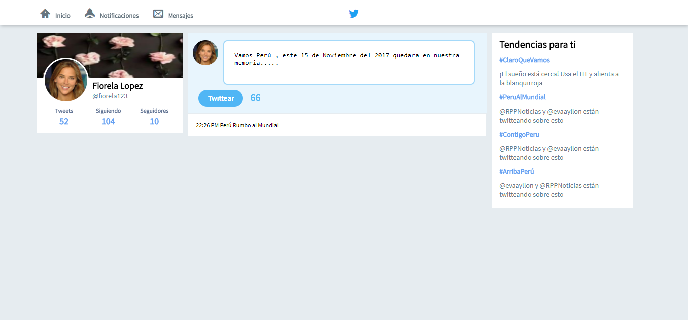

# Réplica de Twitter
---
## Objetivo
---
En este reto, se solicitó replicar el  **newsfeed** de Twitter, según un flujo de versiones para ir habilitando poco a poco la funcionalidad de la página.

## Versiones Solicitadas
---
### Versión 0.0.1

* Diseñar un formulario que permita ingresar un texto y un botón para "twittear".
* Agregar un evento de click al botón o de submit al formulario.
* En el evento, obtener el texto.
* Agregar el texto al HTML.
### Versión 0.0.2

* No ingresar texto vacío (deshabilitar el botón de "twittear").
* Contar la cantidad de caracteres de forma regresiva.
### Versión 0.0.3

* Si pasa los 140 caracteres, deshabilitar el botón.
* Si pasa los 120 caracteres, mostrar el contador con OTRO color.
* Si pasa los 130 caracteres, mostrar el contador con OTRO color.
* Si pasa los 140 caracteres, mostrar el contador en negativo.
### Versión 0.0.4

* Al presionar enter que crezca el textarea de acuerdo al tamaño del texto.
### Versión 0.0.5 (Extra)

* Si la cantidad de caracteres ingresados (sin dar un enter), supera al tamaño del textarea por defecto, debe de agregarse una línea más para que no aparezca el scroll. (Si en caso aplica)
### Versión 0.0.6 (Extra)

* Agregar la hora en que se publicó el tweet. En el formato de 24 horas: hh:mm.

## Especificaciones de la Página
--- 
* La página principal es denominada `index.html` en el cual se encuentra la  estructura del proyecto y se enlaza la hoja  de estilos (CSS).

* En la carpeta `css` se encuentra el archivo `main.css` donde se han agragado los  estilos necesarios para el proyecto.

* En la carpeta `assets` se encuentra la carpeta `images` donde estan las imágenes necesarias para el proyecto.

* Esta web utiliza 1 tipografía :   `Source Sans Pro`.

* La paleta de colores se basa en estos tres : `#66a1f2`, `#1da1f2`,
  `#e6ecf0`.

* Los íconos se obtuvieron de  [IcoMoon](https://icomoon.io/app/).

* En el desarrollo del proyecto se han utilizado diferentes tipos de efectos sobre algunos títulos e imágenes, todo esto especificado en la hoja de estilos main.css.

Realizado por Carla Centeno Ramos.